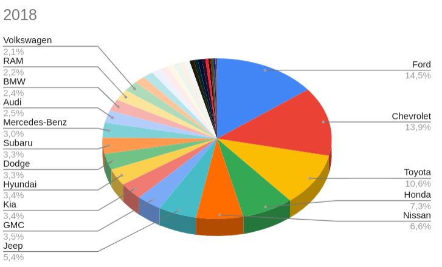
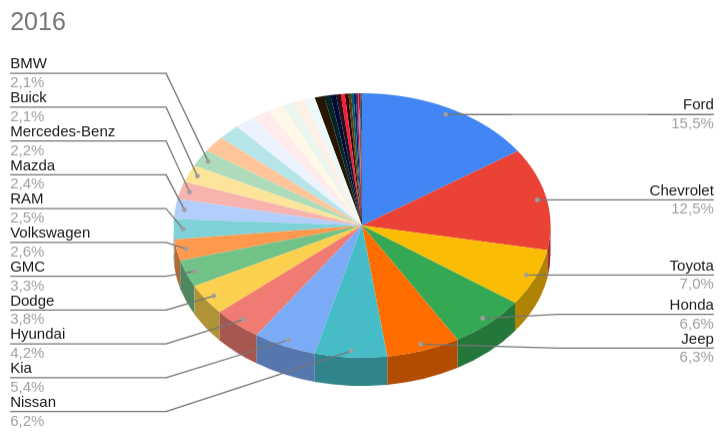

## Dataset Exploration
## About Dataset
### Context
The dataset contains 3 million real world used cars details.

### Content
This data was obtained by running a self made crawler on Cargurus inventory in September 2020. The data set has 66 columns, and they are as follows:

| Field Name               | Data Type    | Description                                                                                                      |
|--------------------------|--------------|------------------------------------------------------------------------------------------------------------------|
| vin                       | String       | Vehicle Identification Number is a unique encoded string for every vehicle. Read more at https://www.autocheck.com/vehiclehistory/vin-basics |
| back_legroom             | String       | Legroom in the rear seat.                                                                                        |
| bed                       | String       | Category of bed size (open cargo area) in a pickup truck. Null usually means the vehicle isn't a pickup truck.    |
| bed_height               | String       | Height of bed in inches.                                                                                         |
| bed_length               | String       | Length of bed in inches.                                                                                         |
| body_type                | String       | Body Type of the vehicle, like Convertible, Hatchback, Sedan, etc.                                              |
| cabin                    | String       | Category of cabin size (open cargo area) in a pickup truck, like Crew Cab, Extended Cab, etc.                    |
| city                     | String       | City where the car is listed, like Houston, San Antonio, etc.                                                   |
| city_fuel_economy        | Float        | Fuel economy in city traffic in km per litre.                                                                    |
| combine_fuel_economy     | Float        | Combined fuel economy is a weighted average of City and Highway fuel economy in km per litre.                    |
| daysonmarket             | Integer      | Days since the vehicle was first listed on the website.                                                         |
| dealer_zip               | Integer      | Zipcode of the dealer.                                                                                           |
| description              | String       | Vehicle description on the vehicle's listing page.                                                               |
| engine_cylinders         | String       | The engine configuration, like I4, V6, etc.                                                                      |
| engine_displacement      | Float        | Engine displacement is the measure of the cylinder volume swept by all of the pistons of a piston engine, excluding the combustion chambers. |
| engine_type              | String       | The engine configuration, like I4, V6, etc.                                                                      |
| exterior_color           | String       | Exterior color of the vehicle, usually a fancy one same as the brochure.                                         |
| fleet                    | Boolean      | Whether the vehicle was previously part of a fleet.                                                              |
| frame_damaged            | Boolean      | Whether the vehicle has a damaged frame.                                                                         |
| franchise_dealer         | Boolean      | Whether the dealer is a franchise dealer.                                                                        |
| franchise_make           | String       | The company that owns the franchise.                                                                             |
| front_legroom            | String       | The legroom in inches for the passenger seat.                                                                     |
| fuel_tank_volume         | String       | Fuel tank's filling capacity in gallons.                                                                         |
| fuel_type                | String       | Dominant type of fuel ingested by the vehicle.                                                                    |
| has_accidents            | Boolean      | Whether the VIN has any accidents registered.                                                                     |
| height                   | String       | Height of the vehicle in inches.                                                                                  |
| highway_fuel_economy     | Float        | Fuel economy in highway traffic in km per litre.                                                                  |
| horsepower               | Float        | Horsepower is the power produced by an engine.                                                                    |
| interior_color           | String       | Interior color of the vehicle, usually a fancy one same as the brochure.                                         |
| isCab                    | Boolean      | Whether the vehicle was previously a taxi/cab.                                                                   |
| is_certified             | Boolean      | Whether the vehicle is certified. Certified cars are covered through the warranty period.                        |
| is_cpo                   | Boolean      | Type Boolean. Pre-owned cars certified by the dealer. Certified vehicles come with a manufacturer warranty for free repairs for a certain time period. Read more at https://www.cartrade.com/blog/2015/auto-guides/pros-and-cons-of-buying-a-certified-pre-owned-car-1235.html |
| is_new                    | Boolean       | If True, means the vehicle was launched less than 2 years ago.                                          |
| is_oemcpo                 | Boolean       | Pre-owned cars certified by the manufacturer.                                                            |
| latitude                  | Float         | Latitude from the geolocation of the dealership.                                                         |
| length                    | String        | Length of the vehicle in inches.                                                                         |
| listed_date               | String        | The date the vehicle was listed on the website. Does not make days_on_market obsolete.                    |
| listing_color             | String        | Dominant color group from the exterior color.                                                            |
| listing_id                | Integer       | Listing id from the website.                                                                             |
| longitude                 | Float         | Longitude from the geolocation of the dealership.                                                        |
| main_picture_url          | String        | The URL of the main image of the vehicle.                                                                 |
| major_options             | String | A list of major options for the vehicle, such as transmission, fuel type, entertainment system, etc.     |
| make_name                 | String        | The make of the vehicle.                                                                                 |
| maximum_seating           | Integer       | The maximum seating capacity of the vehicle.                                                              |
| mileage                   | Integer       | The total distance traveled by the vehicle in miles.                                                      |
| model_name                | String        | The name or model of the vehicle.                                                                        |
| owner_count               | Integer       | The number of previous owners of the vehicle.                                                             |
| power                     | Integer       | The power of the engine in horsepower (HP).                                                               |
| price                     | Float         | The price of the vehicle in USD.                                                                         |
| salvage                   | Boolean       | Indicates whether the vehicle has a salvage title.                                                        |
| savings_amount            | Float         | The savings amount in USD compared to the market price.                                                   |
| seller_rating             | Float         | The rating of the seller on a scale of 0 to 5.                                                            |
| sp_id                     | Integer       | The ID of the salesperson.                                                                               |
| sp_name                   | String        | The name of the salesperson.                                                                             |
| theft_title               | Boolean       | Indicates whether the vehicle has a theft title.                                                          |
| torque                    | Integer       | The torque of the engine in pound-feet (lb-ft).                                                           |
| transmission              | String        | The type of transmission (automatic or manual).                                                           |
| transmission_display      | String        | The type of transmission in a human-readable format.                                                      |
| trimId                    | Integer       | The ID of the trim level of the vehicle.                                                                  |
| trim_name                 | String        | The name of the trim level of the vehicle.                                                                |
| vehicle_damage_category   | String        | Indicates the damage category of the vehicle.                                                             |
| wheel_system              | String        | The type of wheel system (2-wheel drive or 4-wheel drive).                                                |
| wheel_system_display      | String        | The type of wheel system in a human-readable format.                                                      |
| wheelbase                 | String        | The distance between the centers of the front and rear wheels of the vehicle.                            |
| width                     | String        | The width of the vehicle in inches.                                                                       |
| year                      | Integer       | The year the vehicle was manufactured.                                                                   |


### Grain
Each row in the data set represents a used car listed by Cargurus inventory.

### Acknowledgements
This data is for academic, research and individual experimentation only and is not intended for commercial purposes.

Link: https://www.kaggle.com/datasets/ananaymital/us-used-cars-dataset

## Schema definition

The schema definition can be found in CarSchema.scala. Below is the code fragment with the schema definition:

```scala
  val schema = StructType(Array(
    StructField("vin", StringType),
    StructField("back_legroom", StringType),
    StructField("bed", StringType),
    StructField("bed_height", StringType),
    StructField("bed_length", StringType),
    StructField("body_type", StringType),
    StructField("cabin", StringType),
    StructField("city", StringType),
    StructField("city_fuel_economy", FloatType),
    StructField("combine_fuel_economy", FloatType),
    StructField("daysonmarket", IntegerType),
    StructField("dealer_zip", IntegerType),
    StructField("description", StringType),
    StructField("engine_cylinders", StringType),
    StructField("engine_displacement", FloatType),
    StructField("engine_type", StringType),
    StructField("exterior_color", StringType),
    StructField("fleet", BooleanType),
    StructField("frame_damaged", BooleanType),
    StructField("franchise_dealer", BooleanType),
    StructField("franchise_make", StringType),
    StructField("front_legroom", StringType),
    StructField("fuel_tank_volume", StringType),
    StructField("fuel_type", StringType),
    StructField("has_accidents", BooleanType),
    StructField("height", StringType),
    StructField("highway_fuel_economy", FloatType),
    StructField("horsepower", FloatType),
    StructField("interior_color", StringType),
    StructField("isCab", BooleanType),
    StructField("is_certified", BooleanType),
    StructField("is_cpo", BooleanType),
    StructField("is_new", BooleanType),
    StructField("is_oemcpo", BooleanType),
    StructField("latitude", FloatType),
    StructField("length", StringType),
    StructField("listed_date", StringType),
    StructField("listing_color", StringType),
    StructField("listing_id", IntegerType),
    StructField("longitude", FloatType),
    StructField("main_picture_url", StringType),
    StructField("major_options", StringType),
    StructField("make_name", StringType),
    StructField("maximum_seating", IntegerType),
    StructField("mileage", IntegerType),
    StructField("model_name", StringType),
    StructField("owner_count", IntegerType),
    StructField("power", IntegerType),
    StructField("price", FloatType),
    StructField("salvage", BooleanType),
    StructField("savings_amount", FloatType),
    StructField("seller_rating", FloatType),
    StructField("sp_id", IntegerType),
    StructField("sp_name", StringType),
    StructField("theft_title", BooleanType),
    StructField("torque", IntegerType),
    StructField("transmission", StringType),
    StructField("transmission_display", StringType),
    StructField("trimId", IntegerType),
    StructField("trim_name", StringType),
    StructField("vehicle_damage_category", StringType),
    StructField("wheel_system", StringType),
    StructField("wheel_system_display", StringType),
    StructField("wheelbase", StringType),
    StructField("width", StringType),
    StructField("year", IntegerType)
  ))
```

### Percentage of nulls by field

| field                    | null_count | percentage |
|-------------------------|---------:|-----------:|
|         owner_count|   3000205|  100.00 %|
|               power|   3000204|  100.00 %|
|              torque|   3000204|  100.00 %|
|              trimId|   3000201|  100.00 %|
|             mileage|   3000197|  100.00 %|
|        is_certified|   3000196|  100.00 %|
|     maximum_seating|   3000194|  100.00 %|
|vehicle_damage_ca...|   3000172|  100.00 %|
|combine_fuel_economy|   3000124|  100.00 %|
|                 bed|   2980532|   99.34 %|
|               cabin|   2936594|   97.88 %|
|           is_oemcpo|   2864840|   95.49 %|
|              is_cpo|   2817306|   93.90 %|
|          bed_length|   2571062|   85.70 %|
|          bed_height|   2571057|   85.70 %|
|         theft_title|   1427168|   47.57 %|
|             salvage|   1427167|   47.57 %|
|       frame_damaged|   1427161|   47.57 %|
|       has_accidents|   1427145|   47.57 %|
|               isCab|   1427142|   47.57 %|
|               fleet|   1427141|   47.57 %|
|      franchise_make|    572838|   19.09 %|
|highway_fuel_economy|    491819|   16.39 %|
|   city_fuel_economy|    491696|   16.39 %|
|    main_picture_url|    369643|   12.32 %|
|               sp_id|    250617|    8.35 %|
|       major_options|    200611|    6.69 %|
| engine_displacement|    173055|    5.77 %|
|          horsepower|    172993|    5.77 %|
|               width|    159928|    5.33 %|
|           wheelbase|    159921|    5.33 %|
|              length|    159766|    5.33 %|
|       front_legroom|    159743|    5.32 %|
|    fuel_tank_volume|    159728|    5.32 %|
|              height|    159720|    5.32 %|
|        back_legroom|    159582|    5.32 %|
|        wheel_system|    147389|    4.91 %|
|wheel_system_display|    147388|    4.91 %|
|           trim_name|    116952|    3.90 %|
|    engine_cylinders|    101040|    3.37 %|
|         engine_type|    101036|    3.37 %|
|           fuel_type|     83193|    2.77 %|
|         description|     78270|    2.61 %|
|transmission_display|     64821|    2.16 %|
|        transmission|     64817|    2.16 %|
|       seller_rating|     41524|    1.38 %|
|           body_type|     13917|    0.46 %|
|                year|       711|    0.02 %|
|    franchise_dealer|       701|    0.02 %|
|              is_new|       694|    0.02 %|
|      savings_amount|       691|    0.02 %|
|               price|       686|    0.02 %|
|            latitude|       680|    0.02 %|
|          dealer_zip|       675|    0.02 %|
|           longitude|       667|    0.02 %|
|          listing_id|       659|    0.02 %|
|             sp_name|       642|    0.02 %|
|          model_name|       628|    0.02 %|
|           make_name|       595|    0.02 %|
|       listing_color|       512|    0.02 %|
|         listed_date|       495|    0.02 %|
|      interior_color|       489|    0.02 %|
|      exterior_color|       473|    0.02 %|
|        daysonmarket|       465|    0.02 %|
|                city|       374|    0.01 %|
|                 vin|         0|    0.00 %|

## Outliers

For the calculation of outliers, it was first decided to apply the interquartile range technique, which basically consists of the calculation of two limits, lower and upper, which serve as a filter to obtain the outliers of the dataset. It should be clarified that this technique does not detect all the outliers, but for a first approximation it is quite useful. After obtaining these values (InterquartileRangeYear.scala), which returned the filters of Min: 2012.5 Max: 2024.5, we agreed with the business to take those years that cover as a floor 80% of the records of the dataset. And for this we considered the years between 2015 and 2021.
Code about the interquartile range technique available in InterquartileRangeYear.scala or below:

```scala
    val numericYearsDF = df.withColumn("numeric_year", col("year") - 1914)
    val quantiles = numericYearsDF.stat.approxQuantile("numeric_year", Array(0.25, 0.5, 0.75), 0.01)
    val Q1 = quantiles(0)
    val Q3 = quantiles(2)
    val IQR = Q3 - Q1
    val lowerLimit = Q1 - 1.5 * IQR
    val upperLimit = Q3 + 1.5 * IQR
    println(s"Min: ${1914 + lowerLimit} Max: ${1914 + upperLimit}")
```

## How the Dataset is processed

There are five main files on the project inside the usedcaranalysis package.

### CarAnalysisPerYear.scala

In this file you will be able to find the code needed to calculate the percentage of cars by brand registered between 2015 and 2021 (percentage of market dominance of brands by year).

### Top3MarketBrandRankings2015to2021.Scala

In this file you will be able to find the code needed to see the evolution of the three brands registering the most cars between 2015 and 2021.

### EvolutionOfTheThreeBrandsThatDominateTheMarketIn2021.scala

In this file you will be able to find the code needed to see the evolution of the three brands that dominate the market in 2021.

### HistoricalSegmentByBrandAndPrice.scala

In this file you will be able to find the code needed to see the historical segment per price and per brand.

### HistoricalSegmentByBrand.scala

In this file you will be able to find the code needed to see the historical segments by brand.

## Questions to answer with the dataset

### How to work with the dataset?
The first thing that was done was a study of all the information that made up the dataset.
As outliers in the year field we can identify several values to review.
To begin with, the years to identify should be from 1915 to 2021 (last year of the dataset sampling).

-Percentage of values that are above the year 2021: 0.0%.

-Percentage of values below the year 1915: 0.0%.

The code for the percentage calculation can be found in the OutliersAnalysis.scala file.

```scala
  val lessThanTheYear1915 = df
      .filter(col("year") < 1915)
      .agg(count("*").alias("total"))
      .withColumn("type_of_information", lit("Less than 1915"))
      .withColumn("percentage_of_dataset", round(col("total") / totalRowsDataset * 100, 2))
      .select(col("type_of_information"), col("total"), col("percentage_of_dataset"))

  //similar code for between1915And1949, between1950And1999, between2000And2014, between2014And2021, yearNulls

  lessThanTheYear1915.union(olderThanTheYear2021)
    .union(between1915And1949)
    .union(between1950And1999)
    .union(between2000And2014)
    .union(between2014And2021)
    .union(yearNulls)
    .orderBy(col("total").desc)
    .show()
```

The resulting dataframe according to the dataset we work with is the one we see below:

| type_of_information                    |     total | percentage_of_dataset |
|-------------------------|----------:|-----------:|
|       2015 to 2021|2583877|                86.12|
|       2000 to 2014| 403381|                13.45|
|       1950 to 1999|  11916|                  0.4|
|               Null|    711|                 0.02|
|       1915 to 1949|    325|                 0.01|
|     Less than 1915|      0|                  0.0|
|  Greater than 2021|      0|                  0.0|


On the other hand, the number of vehicles per year between 1915 and 1999, is always less than 3%,
so it was considered that in order to have a more accurate analysis of the current market, all useful data from 2015 to 2021 (which this range covers 86.12% of the total dataset) should be taken into account.
For the analysis in question, it was decided to consider all the years with at least 3% of cars in the useful data records.

| year  | total_cars_per_year | percentage_of_dataset |
|------|---------:|-----------:|
|2021|                 176513|                         6.64|
|2020|                1349678|                        50.73|
|2019|                 284620|                         10.7|
|2018|                 210357|                         7.91|
|2017|                 347968|                        13.08|
|2016|                 122193|                         4.59|
|2015|                  92548|                         3.48|
|2014|                  76448|                         2.87|

The code of this summary can be seen in the file CarAnalysisPerYear.scala. A small fragment is shared below:

```scala
    val year2014 = df
        .filter(col(labelYear) === 2014)
        .agg(count("*").alias(labelTotalPerYear + labelYear))
        .withColumn(labelYear, lit("2014"))
        .withColumn(percentageOfDataset, round(col(labelTotalPerYear + labelYear) / totalRowsDataset * 100, 2))
        .selec  t(col(labelYear), col(labelTotalPerYear + labelYear), col(percentageOfDataset))

    // similar code for year2015, year2016, year2017, year2018, year2019, year2020, year2021

    year2014
      .union(year2015)
      .union(year2016)
      .union(year2017)
      .union(year2018)
      .union(year2019)
      .union(year2020)
      .union(year2021)
      .orderBy(col(labelYear).desc)
      .show()
```

### General summary of dataset information

Full Dataset: It is the complete dataset.

Usefull: It is the information leaked between 2015 and 2021.

N/A: Information with unreadable values (wrong formats, missing fields).

Outlier: It is the information that is part of the outliers.

| type_of_data                    | total_rows | percentage_of_dataset |
|-------------------------|---------:|-----------:|
|Full Dataset|   3000210|                100.0|
|      Useful|   2780768|                92.69|
|     Outlier|    218731|                 7.29|
|         N/A|       711|                 0.02|

The code of this summary can be seen in the file DatasetAnalysis.scala. A small fragment is shared below:

```scala
    val cleanInformation = yearCounts
      .filter(col("year") >= 2012 and col("year") <= 2024 )
      .agg(sum("count").alias("total_rows"))
      .withColumn("type_of_data", lit("Useful"))
      .withColumn("percentage_of_dataset", round(col("total_rows") / totalRowsDataset * 100, 2))
      .select(col("type_of_data"), col("total_rows"), col("percentage_of_dataset"))
    
    val yearOutliers = yearCounts
      .filter(col("year") < 2012 or col("year") > 2024 )
      .agg(sum("count").alias("total_rows"))
      .withColumn("type_of_data", lit("Outlier"))
      .withColumn("percentage_of_dataset", round(col("total_rows") / totalRowsDataset * 100, 2))
      .select(col("type_of_data"), col("total_rows"), col("percentage_of_dataset"))
    
    val yearNulls = yearCounts
      .filter(col("year") === "N/A")
      .agg(sum("count").alias("total_rows"))
      .withColumn("type_of_data", lit("N/A"))
      .withColumn("percentage_of_dataset", round(col("total_rows") / totalRowsDataset * 100, 2))
      .select(col("type_of_data"), col("total_rows"), col("percentage_of_dataset"))

    totalDataset.union(cleanInformation).union(yearOutliers).union(yearNulls).show()

```

### What is the ranking by year of car brands?

In order to be able to answer and give visibility of this question, what was done was to put together a query that has the total cars by year (regardless of brand),
and then calculate the total cars by brand.
Having these two pieces of information, we can now get the percentage of dominance of a brand in the market according to year.
The query can be seen in the PercentageOfCarBrandsPerYear.scala file. A small fragment is shared below:

```scala
  // Group by year and manufacturer's name and count the number of cars.
  val countOfCarsPerMakeNamePerYear = filterByYear
    .groupBy("year", "make_name")
    .agg(count("*").alias(labelTotalCars))

  private val totalPerYear = "total_per_year"
  val totalCarByYear = filterByYear
    .groupBy("year")
    .agg(count("*").alias(totalPerYear))

  //Join between two dataframes, to have the total number of cars per year for make names, aggregated to all rows
  val dfCarsByYearAndMakeNameWithTotalByCarYear = countOfCarsPerMakeNamePerYear.join(totalCarByYear, Seq("year"))
```

Below are graphs based on the information obtained from the query:

### 2021
In the year 2021, we see that the three leading brands in the market were Kia, Chevrolet y Hyunday.

|year|    make_name|total_cars|total_per_year|          porcentaje|rank|
|-------------------------|---------:|-----------:|-----------:|-----------:|-----------:|
|2021|          Kia|     29955|        176513|   16.97 %|   1|
|2021|    Chevrolet|     25220|        176513|   14.29 %|   2|
|2021|      Hyundai|     23282|        176513|   13.19 %|   3|
|2021|       Toyota|     20229|        176513|   11.46 %|   4|
|2021|        Honda|     16508|        176513|    9.35 %|   5|
|2021|         Jeep|     10691|        176513|    6.06 %|   6|
|2021|          BMW|      9427|        176513|    5.34 %|   7|
|2021|       Subaru|      9392|        176513|    5.32 %|   8|
|2021|          GMC|      6392|        176513|    3.62 %|   9|
|2021|   Volkswagen|      6357|        176513|    3.60 %|  10|
|2021|        Volvo|      4472|        176513|    2.53 %|  11|
|2021|        Mazda|      2904|        176513|    1.65 %|  12|
|2021|        Acura|      2798|        176513|    1.59 %|  13|
|2021|Mercedes-Benz|      2568|        176513|    1.45 %|  14|
|2021|         MINI|       994|        176513|    0.56 %|  15|
|2021|         Ford|       875|        176513|    0.50 %|  16|
|2021|        Buick|       848|        176513|    0.48 %|  17|
|2021|        Lexus|       787|        176513|    0.45 %|  18|
|2021|          RAM|       624|        176513|    0.35 %|  19|
|2021|      Genesis|       555|        176513|    0.31 %|  20|
|2021|     INFINITI|       432|        176513|    0.24 %|  21|
|2021|     Cadillac|       318|        176513|    0.18 %|  22|
|2021|         Audi|       259|        176513|    0.15 %|  23|
|2021|       Nissan|       215|        176513|    0.12 %|  24|
|2021|       Jaguar|       165|        176513|    0.09 %|  25|
|2021|      Porsche|       158|        176513|    0.09 %|  26|
|2021|      Lincoln|        88|        176513|    0.05 %|  27|


### 2020
In the year 2020, we see that the three leading brands in the market were Ford, Chevrolet and Nissan.

|year|    make_name|total_cars|total_per_year|          porcentaje|rank|
|-------------------------|---------:|-----------:|-----------:|-----------:|-----------:|
|2020|         Ford|    257928|       1349678|   19.11 %|   1|
|2020|    Chevrolet|    171233|       1349678|   12.69 %|   2|
|2020|       Nissan|    104863|       1349678|    7.77 %|   3|
|2020|        Honda|    103895|       1349678|    7.70 %|   4|
|2020|       Toyota|     90805|       1349678|    6.73 %|   5|
|2020|         Jeep|     81596|       1349678|    6.05 %|   6|
|2020|          RAM|     66502|       1349678|    4.93 %|   7|
|2020|      Hyundai|     56489|       1349678|    4.19 %|   8|
|2020|          GMC|     41878|       1349678|    3.10 %|   9|
|2020|        Buick|     37910|       1349678|    2.81 %|  10|
|2020|          Kia|     33790|       1349678|    2.50 %|  11|
|2020|        Dodge|     32110|       1349678|    2.38 %|  12|
|2020|   Volkswagen|     31603|       1349678|    2.34 %|  13|
|2020|        Mazda|     27351|       1349678|    2.03 %|  14|
|2020|Mercedes-Benz|     24946|       1349678|    1.85 %|  15|
|2020|       Subaru|     24692|       1349678|    1.83 %|  16|
|2020|     Cadillac|     23949|       1349678|    1.77 %|  17|
|2020|      Lincoln|     17556|       1349678|    1.30 %|  18|
|2020|          BMW|     16594|       1349678|    1.23 %|  19|
|2020|         Audi|     13772|       1349678|    1.02 %|  20|
|2020|     Chrysler|     12869|       1349678|    0.95 %|  21|
|2020|        Acura|     12106|       1349678|    0.90 %|  22|
|2020|        Lexus|     12081|       1349678|    0.90 %|  23|
|2020|   Mitsubishi|     11150|       1349678|    0.83 %|  24|
|2020|     INFINITI|      9445|       1349678|    0.70 %|  25|
|2020|        Volvo|      8053|       1349678|    0.60 %|  26|
|2020|   Land Rover|      6835|       1349678|    0.51 %|  27|
|2020|      Porsche|      5143|       1349678|    0.38 %|  28|
|2020|       Jaguar|      3685|       1349678|    0.27 %|  29|
|2020|         MINI|      2579|       1349678|    0.19 %|  30|
|2020|   Alfa Romeo|      2405|       1349678|    0.18 %|  31|
|2020|      Genesis|      1468|       1349678|    0.11 %|  32|
|2020|     Maserati|      1020|       1349678|    0.08 %|  33|
|2020|         FIAT|       520|       1349678|    0.04 %|  34|
|2020| Aston Martin|       264|       1349678|    0.02 %|  35|
|2020|      McLaren|       137|       1349678|    0.01 %|  36|
|2020|        Tesla|       114|       1349678|    0.01 %|  37|
|2020|      Bentley|        90|       1349678|    0.01 %|  38|
|2020|        Lotus|        66|       1349678|    0.00 %|  39|
|2020|  Rolls-Royce|        63|       1349678|    0.00 %|  40|
|2020|      Ferrari|        49|       1349678|    0.00 %|  41|
|2020|  Lamborghini|        32|       1349678|    0.00 %|  42|
|2020| Freightliner|        23|       1349678|    0.00 %|  43|
|2020|        Karma|        19|       1349678|    0.00 %|  44|


### 2019
In the year 2019, we see that the three leading brands in the market were Ford, Nissan and Chevrolet.

|year|    make_name|total_cars|total_per_year|          porcentaje|rank|
|-------------------------|---------:|-----------:|-----------:|-----------:|-----------:|
|2019|         Ford|     42926|        284620|   15.08 %|   1|
|2019|       Nissan|     33395|        284620|   11.73 %|   2|
|2019|    Chevrolet|     29917|        284620|   10.51 %|   3|
|2019|       Toyota|     25310|        284620|    8.89 %|   4|
|2019|        Dodge|     20255|        284620|    7.12 %|   5|
|2019|         Jeep|     15458|        284620|    5.43 %|   6|
|2019|          RAM|     13579|        284620|    4.77 %|   7|
|2019|      Hyundai|     12088|        284620|    4.25 %|   8|
|2019|        Honda|     11372|        284620|    4.00 %|   9|
|2019|          Kia|      9628|        284620|    3.38 %|  10|
|2019|          GMC|      8418|        284620|    2.96 %|  11|
|2019|   Volkswagen|      7546|        284620|    2.65 %|  12|
|2019|       Subaru|      6405|        284620|    2.25 %|  13|
|2019|     Chrysler|      5580|        284620|    1.96 %|  14|
|2019|Mercedes-Benz|      5149|        284620|    1.81 %|  15|
|2019|   Mitsubishi|      4037|        284620|    1.42 %|  16|
|2019|        Mazda|      3514|        284620|    1.23 %|  17|
|2019|     INFINITI|      3471|        284620|    1.22 %|  18|
|2019|     Cadillac|      3411|        284620|    1.20 %|  19|
|2019|        Buick|      3411|        284620|    1.20 %|  19|
|2019|         Audi|      3183|        284620|    1.12 %|  21|
|2019|          BMW|      2542|        284620|    0.89 %|  22|
|2019|        Lexus|      2413|        284620|    0.85 %|  23|
|2019|      Lincoln|      2121|        284620|    0.75 %|  24|
|2019|        Volvo|      1553|        284620|    0.55 %|  25|
|2019|        Acura|      1401|        284620|    0.49 %|  26|
|2019|   Land Rover|      1224|        284620|    0.43 %|  27|
|2019|      Porsche|      1113|        284620|    0.39 %|  28|
|2019|       Jaguar|       962|        284620|    0.34 %|  29|
|2019|      Genesis|       698|        284620|    0.25 %|  30|
|2019|         MINI|       686|        284620|    0.24 %|  31|
|2019|   Alfa Romeo|       430|        284620|    0.15 %|  32|
|2019|     Maserati|       410|        284620|    0.14 %|  33|
|2019|        Tesla|       348|        284620|    0.12 %|  34|
|2019|         FIAT|       269|        284620|    0.09 %|  35|
|2019|      Ferrari|       112|        284620|    0.04 %|  36|
|2019| Aston Martin|        80|        284620|    0.03 %|  37|
|2019|      McLaren|        51|        284620|    0.02 %|  38|
|2019|  Rolls-Royce|        43|        284620|    0.02 %|  39|
|2019|  Lamborghini|        41|        284620|    0.01 %|  40|
|2019| Freightliner|        30|        284620|    0.01 %|  41|
|2019|      Bentley|        29|        284620|    0.01 %|  42|
|2019|        Karma|        10|        284620|    0.00 %|  43|
|2019|        smart|         1|        284620|    0.00 %|  44|


### 2018
In the year 2018, we see that the three leading brands in the market were Ford, Chevrolet and Toyota.

|year|    make_name|total_cars|total_per_year|          porcentaje|rank|
|-------------------------|---------:|-----------:|-----------:|-----------:|-----------:|
|2018|         Ford|     30584|        210357|   14.54 %|   1|
|2018|    Chevrolet|     29248|        210357|   13.90 %|   2|
|2018|       Toyota|     22221|        210357|   10.56 %|   3|
|2018|        Honda|     15372|        210357|    7.31 %|   4|
|2018|       Nissan|     13942|        210357|    6.63 %|   5|
|2018|         Jeep|     11393|        210357|    5.42 %|   6|
|2018|          GMC|      7463|        210357|    3.55 %|   7|
|2018|          Kia|      7154|        210357|    3.40 %|   8|
|2018|      Hyundai|      7097|        210357|    3.37 %|   9|
|2018|        Dodge|      6849|        210357|    3.26 %|  10|
|2018|       Subaru|      6849|        210357|    3.26 %|  10|
|2018|Mercedes-Benz|      6323|        210357|    3.01 %|  12|
|2018|         Audi|      5240|        210357|    2.49 %|  13|
|2018|          BMW|      4990|        210357|    2.37 %|  14|
|2018|          RAM|      4683|        210357|    2.23 %|  15|
|2018|   Volkswagen|      4381|        210357|    2.08 %|  16|
|2018|        Mazda|      3240|        210357|    1.54 %|  17|
|2018|        Acura|      3138|        210357|    1.49 %|  18|
|2018|        Lexus|      2641|        210357|    1.26 %|  19|
|2018|        Buick|      2461|        210357|    1.17 %|  20|
|2018|     Cadillac|      1929|        210357|    0.92 %|  21|
|2018|     Chrysler|      1927|        210357|    0.92 %|  22|
|2018|        Volvo|      1569|        210357|    0.75 %|  23|
|2018|      Lincoln|      1484|        210357|    0.71 %|  24|
|2018|   Mitsubishi|      1307|        210357|    0.62 %|  25|
|2018|      Porsche|      1181|        210357|    0.56 %|  26|
|2018|     INFINITI|      1181|        210357|    0.56 %|  26|
|2018|   Alfa Romeo|      1070|        210357|    0.51 %|  28|
|2018|   Land Rover|       834|        210357|    0.40 %|  29|
|2018|       Jaguar|       650|        210357|    0.31 %|  30|
|2018|        Tesla|       618|        210357|    0.29 %|  31|
|2018|      Genesis|       356|        210357|    0.17 %|  32|
|2018|         MINI|       354|        210357|    0.17 %|  33|
|2018|         FIAT|       161|        210357|    0.08 %|  34|
|2018|     Maserati|       143|        210357|    0.07 %|  35|
|2018|      Ferrari|       109|        210357|    0.05 %|  36|
|2018|      Bentley|        71|        210357|    0.03 %|  37|
|2018|      McLaren|        37|        210357|    0.02 %|  38|
|2018|  Rolls-Royce|        31|        210357|    0.01 %|  39|
|2018|  Lamborghini|        27|        210357|    0.01 %|  40|
|2018| Aston Martin|        18|        210357|    0.01 %|  41|
|2018|        smart|        16|        210357|    0.01 %|  42|
|2018|        Karma|        11|        210357|    0.01 %|  43|
|2018|        Lotus|         2|        210357|    0.00 %|  44|
|2018| Freightliner|         2|        210357|    0.00 %|  44|



### 2017
In the year 2017, we see that the three leading brands in the market were Ford, Chevrolet and Nissan.

|year|    make_name|total_cars|total_per_year|          porcentaje|rank|
|-------------------------|---------:|-----------:|-----------:|-----------:|-----------:|
|2017|         Ford|     48466|        347968|   13.93 %|   1|
|2017|    Chevrolet|     39924|        347968|   11.47 %|   2|
|2017|       Nissan|     29703|        347968|    8.54 %|   3|
|2017|       Toyota|     26216|        347968|    7.53 %|   4|
|2017|        Honda|     22242|        347968|    6.39 %|   5|
|2017|         Jeep|     17206|        347968|    4.94 %|   6|
|2017|      Hyundai|     14811|        347968|    4.26 %|   7|
|2017|          GMC|     12352|        347968|    3.55 %|   8|
|2017|          BMW|     12101|        347968|    3.48 %|   9|
|2017|          Kia|     11779|        347968|    3.39 %|  10|
|2017|Mercedes-Benz|     11589|        347968|    3.33 %|  11|
|2017|        Buick|      9038|        347968|    2.60 %|  12|
|2017|        Lexus|      8614|        347968|    2.48 %|  13|
|2017|       Subaru|      8420|        347968|    2.42 %|  14|
|2017|   Volkswagen|      8401|        347968|    2.41 %|  15|
|2017|     INFINITI|      7668|        347968|    2.20 %|  16|
|2017|     Cadillac|      6878|        347968|    1.98 %|  17|
|2017|        Mazda|      6516|        347968|    1.87 %|  18|
|2017|        Dodge|      6487|        347968|    1.86 %|  19|
|2017|          RAM|      5909|        347968|    1.70 %|  20|
|2017|      Lincoln|      5899|        347968|    1.70 %|  21|
|2017|         Audi|      5351|        347968|    1.54 %|  22|
|2017|        Acura|      4505|        347968|    1.29 %|  23|
|2017|     Chrysler|      3458|        347968|    0.99 %|  24|
|2017|   Land Rover|      2719|        347968|    0.78 %|  25|
|2017|        Volvo|      2226|        347968|    0.64 %|  26|
|2017|       Jaguar|      1826|        347968|    0.52 %|  27|
|2017|      Porsche|      1715|        347968|    0.49 %|  28|
|2017|   Mitsubishi|      1200|        347968|    0.34 %|  29|
|2017|         MINI|      1195|        347968|    0.34 %|  30|
|2017|     Maserati|      1102|        347968|    0.32 %|  31|
|2017|      Genesis|       663|        347968|    0.19 %|  32|
|2017|         FIAT|       657|        347968|    0.19 %|  33|
|2017|   Alfa Romeo|       441|        347968|    0.13 %|  34|
|2017|        Tesla|       212|        347968|    0.06 %|  35|
|2017|      Bentley|       145|        347968|    0.04 %|  36|
|2017|        smart|       106|        347968|    0.03 %|  37|
|2017|      Ferrari|        74|        347968|    0.02 %|  38|
|2017|  Rolls-Royce|        45|        347968|    0.01 %|  39|
|2017|      McLaren|        38|        347968|    0.01 %|  40|
|2017| Aston Martin|        36|        347968|    0.01 %|  41|
|2017|  Lamborghini|        32|        347968|    0.01 %|  42|
|2017|        Lotus|         2|        347968|    0.00 %|  43|
|2017| Freightliner|         1|        347968|    0.00 %|  44|


### 2016
In the year 2016, we see that the three leading brands in the market were Ford, Chevrolet and Toyota.

|year|    make_name|total_cars|total_per_year|          porcentaje|rank|
|-------------------------|---------:|-----------:|-----------:|-----------:|-----------:|
|2016|         Ford|     18918|        122193|   15.48 %|   1|
|2016|    Chevrolet|     15277|        122193|   12.50 %|   2|
|2016|       Toyota|      8493|        122193|    6.95 %|   3|
|2016|        Honda|      8081|        122193|    6.61 %|   4|
|2016|         Jeep|      7710|        122193|    6.31 %|   5|
|2016|       Nissan|      7550|        122193|    6.18 %|   6|
|2016|          Kia|      6605|        122193|    5.41 %|   7|
|2016|      Hyundai|      5111|        122193|    4.18 %|   8|
|2016|        Dodge|      4632|        122193|    3.79 %|   9|
|2016|          GMC|      4029|        122193|    3.30 %|  10|
|2016|   Volkswagen|      3179|        122193|    2.60 %|  11|
|2016|          RAM|      3047|        122193|    2.49 %|  12|
|2016|        Mazda|      2947|        122193|    2.41 %|  13|
|2016|Mercedes-Benz|      2628|        122193|    2.15 %|  14|
|2016|        Buick|      2589|        122193|    2.12 %|  15|
|2016|          BMW|      2551|        122193|    2.09 %|  16|
|2016|        Lexus|      2400|        122193|    1.96 %|  17|
|2016|       Subaru|      2332|        122193|    1.91 %|  18|
|2016|     Cadillac|      2150|        122193|    1.76 %|  19|
|2016|     Chrysler|      1852|        122193|    1.52 %|  20|
|2016|         Audi|      1609|        122193|    1.32 %|  21|
|2016|      Lincoln|      1261|        122193|    1.03 %|  22|
|2016|   Land Rover|      1171|        122193|    0.96 %|  23|
|2016|     INFINITI|      1123|        122193|    0.92 %|  24|
|2016|        Acura|      1018|        122193|    0.83 %|  25|
|2016|        Volvo|       657|        122193|    0.54 %|  26|
|2016|      Porsche|       561|        122193|    0.46 %|  27|
|2016|   Mitsubishi|       497|        122193|    0.41 %|  28|
|2016|         MINI|       437|        122193|    0.36 %|  29|
|2016|        Scion|       347|        122193|    0.28 %|  30|
|2016|        Tesla|       287|        122193|    0.23 %|  31|
|2016|         FIAT|       283|        122193|    0.23 %|  32|
|2016|       Jaguar|       230|        122193|    0.19 %|  33|
|2016|     Maserati|       176|        122193|    0.14 %|  34|
|2016|        smart|       146|        122193|    0.12 %|  35|
|2016|      Bentley|       103|        122193|    0.08 %|  36|
|2016|      Ferrari|        62|        122193|    0.05 %|  37|
|2016|  Rolls-Royce|        60|        122193|    0.05 %|  38|
|2016|      McLaren|        31|        122193|    0.03 %|  39|
|2016|  Lamborghini|        29|        122193|    0.02 %|  40|
|2016| Aston Martin|        18|        122193|    0.01 %|  41|
|2016|   Alfa Romeo|         5|        122193|    0.00 %|  42|
|2016| Freightliner|         1|        122193|    0.00 %|  43|



### 2015
In the year 2015, we see that the three leading brands in the market were Ford, Chevrolet and Toyota:

|year|    make_name|total_cars|total_per_year|          porcentaje|rank|
|-------------------------|---------:|-----------:|-----------:|-----------:|-----------:|
|2015|         Ford|     13324|         92548|   14.40 %|   1|
|2015|    Chevrolet|     13019|         92548|   14.07 %|   2|
|2015|       Toyota|      6847|         92548|    7.40 %|   3|
|2015|       Nissan|      6428|         92548|    6.95 %|   4|
|2015|         Jeep|      6406|         92548|    6.92 %|   5|
|2015|        Honda|      5038|         92548|    5.44 %|   6|
|2015|          GMC|      4205|         92548|    4.54 %|   7|
|2015|          Kia|      3797|         92548|    4.10 %|   8|
|2015|      Hyundai|      3491|         92548|    3.77 %|   9|
|2015|        Dodge|      3375|         92548|    3.65 %|  10|
|2015|          BMW|      2373|         92548|    2.56 %|  11|
|2015|     Chrysler|      2295|         92548|    2.48 %|  12|
|2015|       Subaru|      2225|         92548|    2.40 %|  13|
|2015|          RAM|      2176|         92548|    2.35 %|  14|
|2015|Mercedes-Benz|      2085|         92548|    2.25 %|  15|
|2015|   Volkswagen|      2057|         92548|    2.22 %|  16|
|2015|        Lexus|      2027|         92548|    2.19 %|  17|
|2015|        Buick|      1470|         92548|    1.59 %|  18|
|2015|         Audi|      1412|         92548|    1.53 %|  19|
|2015|     Cadillac|      1265|         92548|    1.37 %|  20|
|2015|        Mazda|      1043|         92548|    1.13 %|  21|
|2015|     INFINITI|       843|         92548|    0.91 %|  22|
|2015|      Lincoln|       833|         92548|    0.90 %|  23|
|2015|        Acura|       758|         92548|    0.82 %|  24|
|2015|   Mitsubishi|       722|         92548|    0.78 %|  25|
|2015|      Porsche|       461|         92548|    0.50 %|  26|
|2015|   Land Rover|       443|         92548|    0.48 %|  27|
|2015|         MINI|       442|         92548|    0.48 %|  28|
|2015|        Volvo|       400|         92548|    0.43 %|  29|
|2015|         FIAT|       272|         92548|    0.29 %|  30|
|2015|        Scion|       194|         92548|    0.21 %|  31|
|2015|     Maserati|       174|         92548|    0.19 %|  32|
|2015|        Tesla|       159|         92548|    0.17 %|  33|
|2015|       Jaguar|       148|         92548|    0.16 %|  34|
|2015|      Bentley|        85|         92548|    0.09 %|  35|
|2015|      Ferrari|        70|         92548|    0.08 %|  36|
|2015|        smart|        58|         92548|    0.06 %|  37|
|2015|  Rolls-Royce|        40|         92548|    0.04 %|  38|
|2015|  Lamborghini|        38|         92548|    0.04 %|  39|
|2015| Aston Martin|        25|         92548|    0.03 %|  40|
|2015|      McLaren|        15|         92548|    0.02 %|  41|
|2015| Freightliner|         6|         92548|    0.01 %|  42|
|2015|   Alfa Romeo|         4|         92548|    0.00 %|  43|


### Conclusions

Number of times in the top three ranking between 2015 and 2021:

|make_name|    total_times_in_top3|
|-------------------------|---------:|
|Chevrolet|                  7|
|     Ford|                  6|
|   Toyota|                  3|
|   Nissan|                  3|
|      Kia|                  1|
|  Hyundai|                  1|

The code of this ranking can be seen in the file NumberTimesInRanking.scala. A small fragment is shared below:

```scala
  df.toDF("year", "make_name", "total_per_make_name_per_year", "total_car_in_year", "percentage_per_year", "ranking" )
  .filter(col("ranking") <= 3)
  .groupBy(col("make_name"))
  .agg(count("*").alias("total_times_in_top3"))
  .orderBy(col("total_times_in_top3").desc)
  .show()
```

Chevrolet is the car brands that have been part of all rankings.

Hyundai and Kia, despite only being part of the ranking once between 2015 and 2021, in 2021 are the leaders together with Chevrolet in number of cars registered.

### How is the evolution of the three brands with the most cars registered between 2015 and 2021?
The three brands that led the car market between 2015 and 2021 were Ford, Chevrolet and Toyota.
The query can be seen in the Top3MarketBrandRankings2015to2021.scala file. A small snippet of code is shared below:

```scala
    val filterByYear = df
      .filter(col(labelYear).isNotNull)
      .filter(col(labelYear) >= 2015)
      .filter(col(labelYear) <= 2021)
    
    val labelCarPerBrand = "total_car_per_make_name"

    val percentageFormat: Column => Column = (number: Column) => concat(format_number(number * 100, 2), lit(" %"))
    
    // Group by year and manufacturer's name and count the number of cars.
    val countOfCarsPerMakeName = filterByYear
      .groupBy("make_name")
      .agg(count("*").alias(labelCarPerBrand))
    
    // Sort by descending sales total
    val df_sorted = countOfCarsPerMakeName.orderBy(desc(labelCarPerBrand))
    
    // To obtain the first 3 brands by total sales
    val df_top3 = df_sorted.limit(3)
```

The evolution graph can be seen below:


|                     year |    make_name|total_cars|total_per_year|          percentaje |rank|
|-------------------------|---------|-----------|-----------|--------------------|-----------:|
|2021|Chevrolet|     25220|        176513|   14.29 %|   1|
|2021|   Toyota|     20229|        176513|   11.46 %|   2|
|2021|     Ford|       875|        176513|    0.50 %|   3|
|2020|     Ford|    257928|       1349678|   19.11 %|   1|
|2020|Chevrolet|    171233|       1349678|   12.69 %|   2|
|2020|   Toyota|     90805|       1349678|    6.73 %|   3|
|2019|     Ford|     42926|        284620|   15.08 %|   1|
|2019|Chevrolet|     29917|        284620|   10.51 %|   2|
|2019|   Toyota|     25310|        284620|    8.89 %|   3|
|2018|     Ford|     30584|        210357|   14.54 %|   1|
|2018|Chevrolet|     29248|        210357|   13.90 %|   2|
|2018|   Toyota|     22221|        210357|   10.56 %|   3|
|2017|     Ford|     48466|        347968|   13.93 %|   1|
|2017|Chevrolet|     39924|        347968|   11.47 %|   2|
|2017|   Toyota|     26216|        347968|    7.53 %|   3|
|2016|     Ford|     18918|        122193|   15.48 %|   1|
|2016|Chevrolet|     15277|        122193|   12.50 %|   2|
|2016|   Toyota|      8493|        122193|    6.95 %|   3|
|2015|     Ford|     13324|         92548|   14.40 %|   1|
|2015|Chevrolet|     13019|         92548|   14.07 %|   2|
|2015|   Toyota|      6847|         92548|    7.40 %|   3|


### Conclusions

Of the three brands that dominated the market between 2015 and 2021, Ford, Toyota and Chevrolet, only the latter appears in the 2021 ranking, and it appears in second place.

### How is the evolution of the three brands that dominate the market in 2021?
The three brands that dominated the car market in 2021 were Hyundai, Kia and Toyota.
The query can be seen in the EvolutionOfTheThreeBrandsThatDominateTheMarketIn2021.scala file.
A small snippet of code is shared below:

```scala
  val filterByYear2021 = df.filter(col("year").isNotNull).filter(col("year") === 2021)
  // Group by year and manufacturer's name and count the number of cars.
  val countOfCarsPerMakeName = filterByYear2021
    .groupBy("make_name")
    .agg(count("*").alias("total_car_per_make_name"))
  // Sort by descending sales total
  val df_sorted = countOfCarsPerMakeName.orderBy(desc("total_car_per_make_name"))
  // To obtain the first 3 brands by total sales (by filter only those of 2021 are considered).
  val df_top3 = df_sorted.limit(3)
```
The evolution graph (between 2015 and 2021) of the three brands that dominated the market in 2021 can be viewed below:

|year|    make_name|total_cars|total_per_year|          percentaje |rank|
|-------------------------|---------:|-----------:|-----------:|--------------------:|-----------:|
|2021|      Kia|         29955|        176513|   16.97 %|   1|
|2021|Chevrolet|         25220|        176513|   14.29 %|   2|
|2021|  Hyundai|         23282|        176513|   13.19 %|   3|
|2020|Chevrolet|        171233|       1349678|   12.69 %|   1|
|2020|  Hyundai|         56489|       1349678|    4.19 %|   2|
|2020|      Kia|         33790|       1349678|    2.50 %|   3|
|2019|Chevrolet|         29917|        284620|   10.51 %|   1|
|2019|  Hyundai|         12088|        284620|    4.25 %|   2|
|2019|      Kia|          9628|        284620|    3.38 %|   3|
|2018|Chevrolet|         29248|        210357|   13.90 %|   1|
|2018|      Kia|          7154|        210357|    3.40 %|   2|
|2018|  Hyundai|          7097|        210357|    3.37 %|   3|
|2017|Chevrolet|         39924|        347968|   11.47 %|   1|
|2017|  Hyundai|         14811|        347968|    4.26 %|   2|
|2017|      Kia|         11779|        347968|    3.39 %|   3|
|2016|Chevrolet|         15277|        122193|   12.50 %|   1|
|2016|      Kia|          6605|        122193|    5.41 %|   2|
|2016|  Hyundai|          5111|        122193|    4.18 %|   3|
|2015|Chevrolet|         13019|         92548|   14.07 %|   1|
|2015|      Kia|          3797|         92548|    4.10 %|   2|
|2015|  Hyundai|          3491|         92548|    3.77 %|   3|


### Historical Segment By Brand And Price

In HistoricalSegmentByBrandAndPrice.scala file you will be able to find the code needed to see the historical segment per price and per brand.
A small snippet of code is shared below:

```scala
  val lowPrice = 20000
  val highPrice = 40000

  def getPriceSegment(price: Double): String = {
    if (price < lowPrice) {
      "Low"
    } else if (price >= lowPrice && price < highPrice) {
      "Medium"
    } else {
      "High"
    }
  }

  val priceSegmentUDF = udf(getPriceSegment _)
  val priceSegmentType = StringType

  val segmentedData = data
    .withColumn("price_segment", priceSegmentUDF(col("price")).cast(priceSegmentType))

  //segmentedData.select("make_name", "year", "price", "price_segment").show()
  val segmentedDataByMakeNameAndPrice = segmentedData.groupBy("make_name", "price_segment")
    .agg(
      round(avg("price"), 2).alias("avg_price"),
      count("make_name").alias("num_models")
    )
    .withColumn("percentage", percentageFormat(col("num_models") / totalRows))
    .filter(col("num_models") > 1000)
    .orderBy(col("num_models").desc)
```

Below you can see the resulting dataframe:

|year|    make_name|total_cars|total_per_year|          percentaje |rank|
|-------------------------|---------:|-----------:|-----------:|--------------------:|-----------:|
|         Ford|       Medium| 29626.89|    210023|    7.00 %|
|    Chevrolet|       Medium| 28782.01|    171479|    5.72 %|
|         Ford|         High| 52296.35|    144515|    4.82 %|
|        Honda|       Medium| 28034.64|    131100|    4.37 %|
|       Toyota|       Medium| 28542.87|    129463|    4.32 %|
|    Chevrolet|          Low|  14028.7|    126343|    4.21 %|
|         Ford|          Low| 13601.16|    121691|    4.06 %|
|       Nissan|       Medium| 26489.75|    106237|    3.54 %|
|       Nissan|          Low| 14491.47|    102658|    3.42 %|
|         Jeep|       Medium| 29230.54|     94861|    3.16 %|
|       Toyota|          Low| 13568.29|     80076|    2.67 %|
|    Chevrolet|         High| 51962.22|     79015|    2.63 %|
|      Hyundai|       Medium|  26666.9|     71925|    2.40 %|
|        Honda|          Low|  13609.9|     67366|    2.25 %|
|      Hyundai|          Low| 14152.88|     60207|    2.01 %|
|          Kia|          Low| 14710.95|     59927|    2.00 %|
|          RAM|         High| 53491.14|     57751|    1.92 %|
|          Kia|       Medium| 26154.26|     49878|    1.66 %|
|       Subaru|       Medium| 29016.58|     46718|    1.56 %|
|        Dodge|       Medium| 28079.16|     45563|    1.52 %|
|          GMC|       Medium| 30064.61|     44588|    1.49 %|
|          RAM|       Medium| 32105.57|     40170|    1.34 %|
|        Buick|       Medium| 27878.65|     39148|    1.30 %|
|        Dodge|          Low| 13613.42|     37866|    1.26 %|
|        Mazda|       Medium| 28269.45|     37586|    1.25 %|
|         Jeep|         High|  48286.8|     37169|    1.24 %|
|          GMC|         High| 56298.76|     36923|    1.23 %|
|         Jeep|          Low| 14698.47|     36382|    1.21 %|
|   Volkswagen|       Medium| 27685.37|     35851|    1.19 %|
|Mercedes-Benz|         High| 67405.17|     34936|    1.16 %|
|   Volkswagen|          Low|  13358.8|     32935|    1.10 %|


### Conclusions

Of the three brands dominating the 2021 market, only Chevrolet appeared in the previous rankings.
Kia which appears first in the 2021 ranking, in the 2020 ranking it was ranked 11th.
Hyundai appearing third in the 2021 ranking, in the 2020 ranking it was ranked 8th.


### Final conclusion on "the history and future of brands" for this data set

The dominance in the car market has been varying year after year, but there are some brands that are highly valued by the general public.
Among these we find Toyota, Ford and Chevrolet.
We should mention that Chevrolet has been always fighting in the ranking between the years 2015 to 2021.
It is also worth mentioning that in the last year of the study, 2021, there are brands that promise future growth, such as Kia and Hyundai.
However, we will only be able to verify this promise with the passage of time and new market studies.


### Car segment history by brand

In this analysis, we have a summary of the percentage occupied by each brand and segment in the total dataset of the cars listed in Cargurus.
The segments and the percentage of repetition of each segment in the dataset can be seen in the following table.


|body_type|    count_by_brand|percentage|
|-------------------------|---------:|-----------:|
|SUV / Crossover|       1416278|   47.21 %|
|          Sedan|        741961|   24.73 %|
|   Pickup Truck|        474543|   15.82 %|
|      Hatchback|         88361|    2.95 %|
|        Minivan|         79792|    2.66 %|
|          Coupe|         71597|    2.39 %|
|            Van|         47163|    1.57 %|
|          Wagon|         40502|    1.35 %|
|    Convertible|         26004|    0.87 %|
|   Other brands|         14009|    0.47 %|

The file containing this code is the DatasetAnalysisInFieldBodyType.scala. A small code snippet can be seen below:

```scala
  val total = df.count()

  val grouped = df.groupBy("body_type")
    .agg(count("*").alias("count_by_brand"))

  val mainBrands = grouped
    .withColumn("percentage", percentageFormat(col("count_by_brand") / total))
    .orderBy(col("count_by_brand").desc)
    .filter(col("body_type") =!= "null" and col("count_by_brand") > 1000)

  val otherBrands = grouped
    .filter(col("body_type").isNull or col("count_by_brand") <= 1000)
    .agg(sum("count_by_brand").alias("count_by_brand"))
    .withColumn("percentage", percentageFormat(col("count_by_brand") / total))
    .withColumn("body_type", lit("Other brands"))
    .select(col("body_type"), col("count_by_brand"), col("percentage"))

  mainBrands.union(otherBrands).show(600)
```

The summary table of the auto segments by brand is as follows:


|make_name|    body_type|num_models|percentage|
|-------------------------|---------:|-----------:|-----------:|
|         Ford|SUV / Crossover|    180961|    6.03 %|
|         Ford|   Pickup Truck|    176004|    5.87 %|
|    Chevrolet|SUV / Crossover|    173184|    5.77 %|
|         Jeep|SUV / Crossover|    156777|    5.23 %|
|       Nissan|SUV / Crossover|    105412|    3.51 %|
|    Chevrolet|   Pickup Truck|    103631|    3.45 %|
|       Toyota|          Sedan|     97846|    3.26 %|
|          RAM|   Pickup Truck|     95810|    3.19 %|
|        Honda|SUV / Crossover|     87866|    2.93 %|
|       Nissan|          Sedan|     87115|    2.90 %|
|       Toyota|SUV / Crossover|     86833|    2.89 %|
|        Honda|          Sedan|     83164|    2.77 %|
|         Ford|          Sedan|     67958|    2.27 %|
|      Hyundai|SUV / Crossover|     67954|    2.26 %|
|          GMC|SUV / Crossover|     59505|    1.98 %|
|    Chevrolet|          Sedan|     58465|    1.95 %|
|        Buick|SUV / Crossover|     57353|    1.91 %|
|      Hyundai|          Sedan|     56420|    1.88 %|
|          Kia|SUV / Crossover|     55195|    1.84 %|
|       Subaru|SUV / Crossover|     38924|    1.30 %|
|          GMC|   Pickup Truck|     37907|    1.26 %|
|          Kia|          Sedan|     37736|    1.26 %|
|   Volkswagen|          Sedan|     36939|    1.23 %|
|        Mazda|SUV / Crossover|     36336|    1.21 %|
|     Cadillac|SUV / Crossover|     31986|    1.07 %|
|        Dodge|SUV / Crossover|     30978|    1.03 %|
|   Volkswagen|SUV / Crossover|     29067|    0.97 %|
|          BMW|SUV / Crossover|     26433|    0.88 %|
|Mercedes-Benz|SUV / Crossover|     25689|    0.86 %|
|       Toyota|   Pickup Truck|     25634|    0.85 %|
|Mercedes-Benz|          Sedan|     25600|    0.85 %|
|          BMW|          Sedan|     25547|    0.85 %|
|         Ford|            Van|     22411|    0.75 %|
|        Lexus|SUV / Crossover|     22276|    0.74 %|
|     Chrysler|        Minivan|     21598|    0.72 %|
|        Dodge|        Minivan|     21564|    0.72 %|
|      Lincoln|SUV / Crossover|     21561|    0.72 %|
|        Acura|SUV / Crossover|     20573|    0.69 %|
|        Dodge|          Sedan|     20512|    0.68 %|
|        Honda|        Minivan|     19690|    0.66 %|
|     INFINITI|SUV / Crossover|     19163|    0.64 %|
|         Audi|SUV / Crossover|     16853|    0.56 %|
|       Toyota|      Hatchback|     16199|    0.54 %|
|        Lexus|          Sedan|     16092|    0.54 %|
|         Audi|          Sedan|     15773|    0.53 %|
|   Land Rover|SUV / Crossover|     14960|    0.50 %|
|       Nissan|   Pickup Truck|     14901|    0.50 %|
|   Mitsubishi|SUV / Crossover|     14532|    0.48 %|
|         Ford|          Coupe|     14313|    0.48 %|
|        Volvo|SUV / Crossover|     14286|    0.48 %|
|     Cadillac|          Sedan|     14059|    0.47 %|
|    Chevrolet|      Hatchback|     13824|    0.46 %|
|        Honda|      Hatchback|     13585|    0.45 %|
|     Chrysler|          Sedan|     12933|    0.43 %|
|        Dodge|          Coupe|     12702|    0.42 %|
|       Subaru|          Sedan|     12227|    0.41 %|
|       Subaru|          Wagon|     11816|    0.39 %|
|         Jeep|   Pickup Truck|     11634|    0.39 %|
|    Chevrolet|          Coupe|     11449|    0.38 %|
|      Lincoln|          Sedan|     11148|    0.37 %|
|        Mazda|          Sedan|     11046|    0.37 %|
|       Toyota|        Minivan|      9924|    0.33 %|
|        Acura|          Sedan|      9830|    0.33 %|
|          Kia|          Wagon|      9236|    0.31 %|
|    Chevrolet|            Van|      7774|    0.26 %|
|     INFINITI|          Sedan|      7647|    0.25 %|
|        Buick|          Sedan|      6921|    0.23 %|
|      Porsche|SUV / Crossover|      6649|    0.22 %|
|          RAM|            Van|      6527|    0.22 %|
|      Hyundai|      Hatchback|      6501|    0.22 %|
|         Ford|      Hatchback|      6448|    0.21 %|
|   Volkswagen|      Hatchback|      6442|    0.21 %|
|        Honda|          Coupe|      6069|    0.20 %|
|Mercedes-Benz|            Van|      5468|    0.18 %|
|       Subaru|      Hatchback|      5365|    0.18 %|
|       Nissan|      Hatchback|      5255|    0.18 %|
|        Volvo|          Sedan|      5109|    0.17 %|
|         Ford|    Convertible|      5058|    0.17 %|
|          Kia|        Minivan|      4916|    0.16 %|
|Mercedes-Benz|    Convertible|      4790|    0.16 %|
|    Chevrolet|          Wagon|      4779|    0.16 %|
|        Dodge|   Pickup Truck|      4756|    0.16 %|
|       Jaguar|SUV / Crossover|      4493|    0.15 %|
|          BMW|          Coupe|      4240|    0.14 %|
|Mercedes-Benz|          Coupe|      4115|    0.14 %|
|         MINI|      Hatchback|      4003|    0.13 %|
|        Honda|   Pickup Truck|      3801|    0.13 %|
|      Genesis|          Sedan|      3740|    0.12 %|
|    Chevrolet|    Convertible|      3382|    0.11 %|
|        Mazda|      Hatchback|      3238|    0.11 %|
|   Mitsubishi|          Sedan|      3137|    0.10 %|
|      Hyundai|          Coupe|      3012|    0.10 %|
|       Jaguar|          Sedan|      2955|    0.10 %|
|         MINI|SUV / Crossover|      2950|    0.10 %|
|       Nissan|            Van|      2812|    0.09 %|
|          BMW|    Convertible|      2770|    0.09 %|
|      Porsche|          Coupe|      2569|    0.09 %|
|   Mitsubishi|      Hatchback|      2421|    0.08 %|
|   Alfa Romeo|          Sedan|      2176|    0.07 %|
|      Porsche|          Sedan|      2144|    0.07 %|
|        Volvo|          Wagon|      2115|    0.07 %|
|          BMW|          Wagon|      2048|    0.07 %|
|     Maserati|          Sedan|      1984|    0.07 %|
|   Volkswagen|          Wagon|      1952|    0.07 %|
|          GMC|            Van|      1853|    0.06 %|
|         Ford|          Wagon|      1760|    0.06 %|
|   Alfa Romeo|SUV / Crossover|      1722|    0.06 %|
|         Audi|          Coupe|      1722|    0.06 %|
|        Tesla|          Sedan|      1704|    0.06 %|
|         FIAT|      Hatchback|      1610|    0.05 %|
|      Porsche|    Convertible|      1535|    0.05 %|
|     INFINITI|          Coupe|      1453|    0.05 %|
|        Mazda|    Convertible|      1334|    0.04 %|
|          Kia|      Hatchback|      1258|    0.04 %|
|      Pontiac|          Sedan|      1218|    0.04 %|
|         MINI|          Wagon|      1216|    0.04 %|
|       Nissan|          Coupe|      1195|    0.04 %|
|         Audi|          Wagon|      1095|    0.04 %|
|       Toyota|          Coupe|      1084|    0.04 %|
|        Lexus|          Coupe|      1038|    0.03 %|

The code for this dataframe can be seen in the HistoricalSegmentsByBrand.scala file. A small code snippet can be seen below:

```scala
  val totalRows = data.count()
  val percentageFormat: Column => Column = (number: Column) => concat(format_number(number * 100, 2), lit(" %"))
  val segmentedDataByMakeNameAndPrice = data.groupBy("make_name", "body_type")
    .agg(
      count("*").alias("num_models")
    )
    .withColumn("percentage", percentageFormat(col("num_models") / totalRows))
    .filter(col("body_type").isNotNull)
    .filter(col("num_models") > 1000)
    .orderBy(col("num_models").desc)

  segmentedDataByMakeNameAndPrice.show(600)
```

From this last table we can find out which segments the brands historically prefer.
For that we decided to select the brands that historically registered the most cars in our sample, and the brands that in 2021 registered the most cars.
The brands are as follows:

Ford, Toyota, Chevrolet, Kia and Hyundai.

To do so, we applied filters on the resulting dataframe, and sorted by brand to visualize the preferred segments of each of these brands.

Small code snippet below:

```scala
  val segmentedDataByMakeNameAndPrice = data.groupBy("make_name", "body_type")
    .agg(
      count("*").alias("num_models")
    )
    .withColumn("percentage", percentageFormat(col("num_models") / totalRows))
    .filter(col("body_type").isNotNull)
    .filter(col("num_models") > 1000)
    .filter(col("make_name").equalTo("Ford")
      or col("make_name").equalTo("Hyundai")
      or col("make_name").equalTo("Toyota")
      or col("make_name").equalTo("Chevrolet")
      or col("make_name").equalTo("Kia")
      )
    .orderBy(col("num_models").desc)
    .orderBy(col("make_name").desc)
``` 

Resulting dataframe:


| make_name                |    body_type    | num_models  | percentage  |
|:-------------------------|:---------------:|:-----------:|:-----------:|
|   Toyota|          Sedan|     97846|    3.26 %|
|   Toyota|SUV / Crossover|     86833|    2.89 %|
|   Toyota|   Pickup Truck|     25634|    0.85 %|
|   Toyota|      Hatchback|     16199|    0.54 %|
|   Toyota|        Minivan|      9924|    0.33 %|
|   Toyota|          Coupe|      1084|    0.04 %|
|      Kia|SUV / Crossover|     55195|    1.84 %|
|      Kia|          Sedan|     37736|    1.26 %|
|      Kia|          Wagon|      9236|    0.31 %|
|      Kia|        Minivan|      4916|    0.16 %|
|      Kia|      Hatchback|      1258|    0.04 %|
|  Hyundai|SUV / Crossover|     67954|    2.26 %|
|  Hyundai|          Sedan|     56420|    1.88 %|
|  Hyundai|      Hatchback|      6501|    0.22 %|
|  Hyundai|          Coupe|      3012|    0.10 %|
|     Ford|SUV / Crossover|    180961|    6.03 %|
|     Ford|   Pickup Truck|    176004|    5.87 %|
|     Ford|          Sedan|     67958|    2.27 %|
|     Ford|            Van|     22411|    0.75 %|
|     Ford|          Coupe|     14313|    0.48 %|
|     Ford|      Hatchback|      6448|    0.21 %|
|     Ford|    Convertible|      5058|    0.17 %|
|     Ford|          Wagon|      1760|    0.06 %|
|Chevrolet|SUV / Crossover|    173184|    5.77 %|
|Chevrolet|   Pickup Truck|    103631|    3.45 %|
|Chevrolet|          Sedan|     58465|    1.95 %|
|Chevrolet|      Hatchback|     13824|    0.46 %|
|Chevrolet|          Coupe|     11449|    0.38 %|
|Chevrolet|            Van|      7774|    0.26 %|
|Chevrolet|          Wagon|      4779|    0.16 %|
|Chevrolet|    Convertible|      3382|    0.11 %|