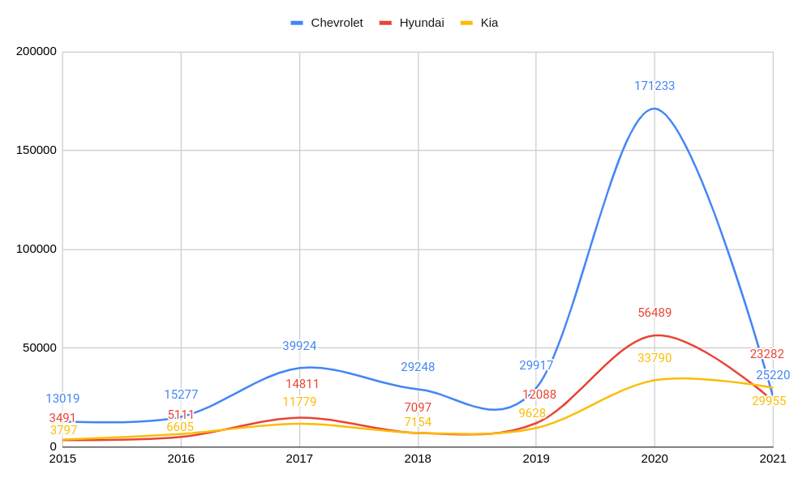

## Dataset Exploration
## About Dataset
### Context
The dataset contains 3 million real world used cars details.

### Content
This data was obtained by running a self made crawler on Cargurus inventory in September 2020.

### Acknowledgements
This data is for academic, research and individual experimentation only and is not intended for commercial purposes.

Link: https://www.kaggle.com/datasets/ananaymital/us-used-cars-dataset

## How the Dataset is processed

There is 3 Main files on the Project inside the myDataset Package.

### CarApplication.scala

In this file you will be able to find the code needed to calculate the percentage of cars by brand registered between 2015 and 2021 (percentage of market dominance of brands by year).

### Top3MarketBrandRankings2015to2021.Scala

In this file you will be able to find the code needed to see the evolution of the three brands registering the most cars between 2015 and 2021.

### EvolutionOfTheThreeBrandsThatDominateTheMarketIn2021.scala

In this file you will be able to find the code needed to see the evolution of the three brands that dominate the market in 2021.

## Questions to answer with the dataset

### How to work with the dataset?
The first thing that was done was a study of all the information that made up the dataset. It was decided to discard the rows that did not have a year, and to keep only the rows that were between 2015 and 2021.

-Total rows: 3,000,507

-Filtered between years 2015 and 2021: 1,478,770 / 3,000,507 = 49%.

-Data with years in null: 1,179,751 / 3,000,507 = 39%.

### What is the ranking by year of car brands?

In order to be able to answer and give visibility of this question, what was done was to put together a query that has the total cars by year (regardless of brand), and then calculate the total cars by brand. Having these two pieces of information, we can now get the percentage of dominance of a brand in the market according to the model.
The query can be seen in the CarApplication.scala file.
Below are graphs based on the information obtained from the query:

### 2021
In the year 2021, we see that the three leading brands in the market were Hyunday, Kia y Toyota.

### 2020
In the year 2020, we see that the three leading brands in the market were Ford, Honda and Chevrolet.

### 2019
In the year 2019, we see that the three leading brands in the market were Ford, Nissan and Toyota.

### 2018
In the year 2018, we see that the three leading brands in the market were Ford, Toyota and Chevrolet.

### 2017
In the year 2017, we see that the three leading brands in the market were Ford, Nissan and Toyota.

### 2016
In the year 2016, we see that the three leading brands in the market were Ford, Chevrolet and Toyota.

### 2015
In the year 2015, we see that the three leading brands in the market were Ford, Chevrolet and Toyota:

### How is the evolution of the three brands with the most cars registered between 2015 and 2021?
The three brands that led the car market between 2015 and 2021 were Ford, Chevrolet and Toyota. The evolution graph can be seen below:

### How is the evolution of the three brands that dominate the market in 2021?
The three brands that dominated the car market in 2021 were Hyundai, Kia and Toyota. The evolution graph (between 2015 and 2021) of the three brands that dominated the market in 2021 can be viewed below:

