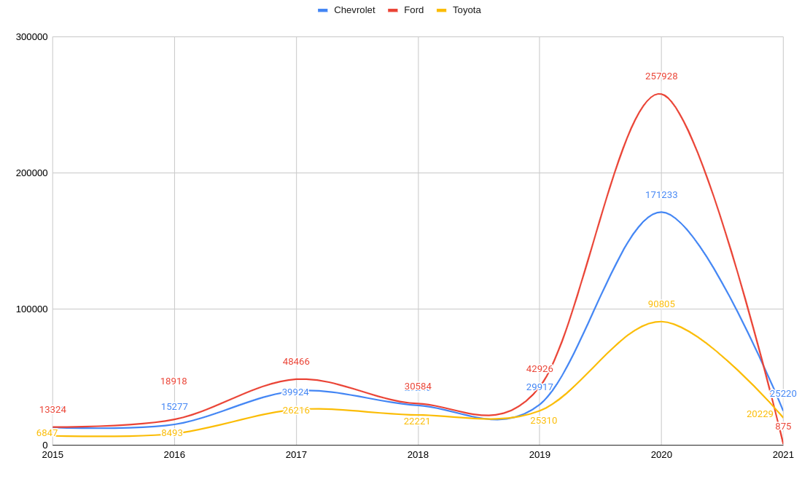

## Dataset Exploration
## About Dataset
### Context
The dataset contains 3 million real world used cars details.

### Content
This data was obtained by running a self made crawler on Cargurus inventory in September 2020.

### Acknowledgements
This data is for academic, research and individual experimentation only and is not intended for commercial purposes.

Link: https://www.kaggle.com/datasets/ananaymital/us-used-cars-dataset

## How the Dataset is processed

There is 3 Main files on the Project inside the myDataset Package.

### CarApplication.scala

In this file you will be able to find the code needed to calculate the percentage of cars by brand registered between 2015 and 2021 (percentage of market dominance of brands by year).

### Top3MarketBrandRankings2015to2021.Scala

In this file you will be able to find the code needed to see the evolution of the three brands registering the most cars between 2015 and 2021.

### EvolutionOfTheThreeBrandsThatDominateTheMarketIn2021.scala

In this file you will be able to find the code needed to see the evolution of the three brands that dominate the market in 2021.

## Questions to answer with the dataset

### How to work with the dataset?
The first thing that was done was a study of all the information that made up the dataset. It was decided to discard the rows that did not have a year, and to keep only the rows that were between 2015 and 2021.
As outliers in the year field we can identify several values to review.
To begin with, the years to identify should be from 1886 (year of creation of the first car in the world) to 2021 (last year of the dataset sampling). But when analyzing the dataset, we see that there is a small percentage that does not meet the expected value.

-Percentage of values that are above the year 2021: 0.23% (7042 rows).

-Percentage of values below the year 1886: 0.12% (317 rows).

The code for the percentage calculation can be found in the OutliersAnalysis.scala file. The resulting dataframe according to the dataset we work with is the one we see below:

On the other hand, the number of vehicles per year between 1900 and 2014, is always less than 4%, so it was considered that in order to have a more accurate analysis of the current market, all useful data from 2015 to 2021 (which this range covers 49.28% of the total dataset) should be taken into account.
For the analysis in question, it was decided to consider all the years with at least 4% of cars in the useful data records.

### General summary of dataset information

Full Dataset: It is the complete dataset.

Usefull: It is the information leaked between 2015 and 2021.

N/A: It is the information that contains nulls.

Outlier: It is the information that is part of the outliers.

The code of this summary can be seen in the file DatasetAnalysis.scala

### Statistics from useful data.

The code of this summary can be seen in the file CarAnalysisByYear.scala

### What is the ranking by year of car brands?

In order to be able to answer and give visibility of this question, what was done was to put together a query that has the total cars by year (regardless of brand), and then calculate the total cars by brand. Having these two pieces of information, we can now get the percentage of dominance of a brand in the market according to the model.
The query can be seen in the CarApplication.scala file.
Below are graphs based on the information obtained from the query:

### 2021
In the year 2021, we see that the three leading brands in the market were Hyunday, Kia y Toyota.

### 2020
In the year 2020, we see that the three leading brands in the market were Ford, Honda and Chevrolet.

### 2019
In the year 2019, we see that the three leading brands in the market were Ford, Nissan and Toyota.

### 2018
In the year 2018, we see that the three leading brands in the market were Ford, Toyota and Chevrolet.

### 2017
In the year 2017, we see that the three leading brands in the market were Ford, Nissan and Toyota.

### 2016
In the year 2016, we see that the three leading brands in the market were Ford, Chevrolet and Toyota.

### 2015
In the year 2015, we see that the three leading brands in the market were Ford, Chevrolet and Toyota:

### Conclusions

Number of times in the top three ranking between 2015 and 2021:

-Toyota: 6

-Ford: 6

-Chevrolet: 4

-Nissan: 2

-Hyundai: 1

-Kia: 1

-Honda: 1

Toyota and Ford are the car brands that have been part of the ranking the most times.

Hyundai and Kia, despite only being part of the ranking once between 2015 and 2021, in 2021 are the leaders in number of cars registered.

### How is the evolution of the three brands with the most cars registered between 2015 and 2021?
The three brands that led the car market between 2015 and 2021 were Ford, Chevrolet and Toyota. The query can be seen in the Top3MarketBrandRankings2015to2021.scala file. The evolution graph can be seen below:

### Conclusions

Of the three brands that dominated the market between 2015 and 2021, Ford, Chevrolet and Toyota, only the latter appears in the 2021 ranking, and it appears in third place. In the 2021 ranking, Chevrolet appears in rank 4, and Ford drops to rank 15.

### How is the evolution of the three brands that dominate the market in 2021?
The three brands that dominated the car market in 2021 were Hyundai, Kia and Toyota. The query can be seen in the EvolutionOfTheThreeBrandsThatDominateTheMarketIn2021.scala file. The evolution graph (between 2015 and 2021) of the three brands that dominated the market in 2021 can be viewed below:

### Conclusions

Of the three brands dominating the 2021 market, only Toyota appeared in the previous rankings (with the exception of 2020 which appeared in rank 4, then appeared in the top three rankings 2015, 2016, 2017, 2018, 2019 and 2021).
Hyundai appearing first in the 2021 ranking, in the 2020 ranking it was ranked 6th.
Kia which appears second in the 2021 ranking, in the 2020 ranking it was ranked 8th.

### Final conclusion
The dominance in the car market has been varying year after year, but there are some brands that are highly valued by the general public. Among these we find Toyota, Ford and Chevrolet. We should mention that Toyota has been almost always fighting in the ranking between the years 2015 to 2021. It is also worth mentioning that in the last year of the study, 2021, there are brands that promise future growth, such as Hyundai and Kia. However, we will only be able to verify this promise with the passage of time and new market studies.